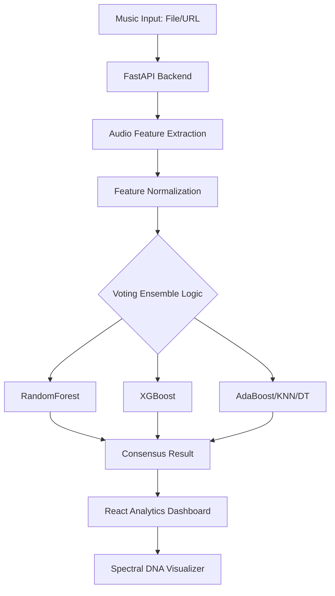

# 🎧 Music Success Predictor: The Ensemble Analytics Suite

A high-performance machine learning system designed to predict track popularity by analyzing acoustic features. Built with a **Voting Ensemble** architecture and a real-time **Spectral DNA** visualization dashboard.

---

## 🏛️ System Architecture



## 🏁 Quick Start

### **1. Analytics Dashboard (UI)**
```bash
cd website/frontend
npm install && npm run dev
```

### **2. Prediction Engine (API)**
```bash
# Recommended: Create a virtual environment first
cd website/backend
pip install -r requirements.txt
uvicorn main:app --reload
```

### **3. Research & Training**
Explore the full model development lifecycle in the [model-code/](./model-code/) directory.
```bash
# Launch the Jupyter research pipeline
jupyter notebook model-code/MusicPredictor_Pipeline.ipynb
```

## 🚀 Key Features

*   **Multi-Input Ingestion**: Process local `.mp3`/`.wav` files or analyze any YouTube track directly via URL.
*   **Ensemble Voting Consensus**: Predictions are powered by the combined intelligence of 5 distinct models, ensuring high reliability (78.94% Random Forest Accuracy / 71.7% Ensemble Consensus).
*   **Spectral DNA Visualization**: A real-time, interactive dashboard that visualizes track energy, tempo, and loudness "fingerprints."
*   **Emerging Track Optimization**: Popularity threshold set at **15** to specifically capture rising indie and regional hits.

## 🛠️ Technology Stack

### **Machine Learning & Intelligence**
- **Core Engine**: Scikit-Learn, XGBoost
- **Feature Extraction**: Librosa (22,050Hz Sampling)
- **Serialization**: Joblib (Optimized for Large Weights)
- **Class Balancing**: Under-sampling algorithm (50:50 Target Ratio)

### **Analytics Dashboard**
- **Frontend**: React 19, TypeScript, Vite
- **UI/UX Engine**: Framer Motion (Micro-animations), Lucide Icons
- **Backend API**: FastAPI (Python 3.10+), Pydantic
- **Audio Processing**: FFmpeg + yt-dlp (YouTube Extraction)

## 🧠 Research Methodology & Analytical Pipeline

Our research framework is designed to move beyond generic binary classification by optimizing for **Emerging Hits** (tracks with growing momentum but limited mainstream airplay).

### **1. Data Preprocessing & Signal Cleaning**
To ensure the integrity of the ensemble's learning environment, we implemented a 4-stage preprocessing pipeline:
- **Null-Value Sanitation**: Massive dataset cleanup by removing any samples with incomplete metadata or missing acoustic features.
- **Acoustical Signature Validation**: Filtering for tracks with `energy > 0.1`. This eliminates "silent" assets, podcasts, and low-energy noise, ensuring the model only learns from actual musical structures.
- **Feature Scaling (StandardScaler)**: Since acoustic metrics vary wildly in range (e.g., Loudness is measured in decibels, Tempo in BPM), we applied **Z-score Normalization**. This prevents features with larger numerical ranges from overpowering the model during training.
- **Threshold Calibration**: Established at **Popularity: 15** to capture the nuance of emerging regional hits while maintaining high predictive precision for independent labels.

### **2. Acoustic DNA: Feature Extraction**
The system transforms raw audio into a high-dimensional vector for the Ensemble Model. Key features extracted using librosa and pyloudnorm include:

| Feature Group | Description | Analytic Purpose |
|:---|:---|:---|
| **Tempo (BPM)** | Dynamic Tempo Estimation | Correlates with track energy and audience engagement (Danceability). |
| **Spectral Centroid** | Mean Frequency Center | Identifies "Brightness". Professional hits generally have balanced high-frequency energy. |
| **RMS Energy** | Root Mean Square Energy | Direct proxy for track "Power" and intensity (Targeted -14.0 LUFS). |
| **Key & Mode** | Chroma CQT Correlation | Detects harmonic compatibility (e.g., Major keys are statistically prevalent in Top 40). |
| **Duration (ms)** | Temporal Metadata | Modern hits optimize for the 2:30 - 3:15 window for streaming retention. |
| **Loudness** | Integrated ITU-R Norm | Normalized to streaming industry standards (-14.0 LUFS) for fair comparison. |

### **3. Strategic Class Balancing (Undersampling)**
To eliminate majority-class bias (where a model might simply guess the more common "Flop" label), we implemented a **1:1 Undersampling** strategy. We strictly balanced the training set to ensure the model identifies the true structural patterns of success.

| Stage | Hits (Pop ≥ 15) | Flops (Pop < 15) | Total Samples |
|---|---|---|---|
| Initial Collection | 87,692 | 26,308 | 114,000 |
| **Balanced Cleaned Dataset** | **25,384** | **25,384** | **50,768** |

### **4. Evaluation Integrity**
We utilized a **Stratified 80/20 Train-Test Split**. This ensures that the 50:50 class balance is perfectly preserved in both the training phase and the validation phase, preventing accidental sampling bias during performance evaluation.

### **5. The 'Big 5' Ensemble Architecture**
We utilize a **Voting Consensus Mechanism** to minimize variance and increase prediction robustness across different genres:
1.  **RandomForest**: Captures complex non-linear feature interactions.
2.  **XGBoost**: Gradient-boosted decision trees for precision.
3.  **AdaBoost**: Iteratively focuses on difficult-to-classify samples.
4.  **K-Nearest Neighbors (KNN)**: Relies on local structural similarities.
5.  **DecisionTree**: Provides the foundational logical framework.

### **6. Benchmark Analytics**
Below are the training performance results across 50,768 balanced diverse samples:

| Rank | Model | Accuracy | F1-Score | Status / Consensus Role |
|:---:|---|:---:|:---:|---|
| 1 | **Random Forest** | **78.94%** | **0.797** | **Top Model (Best Single Performance)** |
| 2 | **Multi-Vote Model (Ensemble)** | **71.70%** | **0.721** | **Consensus Decision (Reduced False Positives)** |
| 3 | **K-Nearest Neighbors (KNN)** | **68.84%** | **0.681** | **Balanced Classifier** |
| 4 | **XGBoost** | **68.76%** | **0.694** | **Strong Classifier** |
| 5 | **Decision Tree** | **62.26%** | **0.629** | **Classic Classifier** |
| 6 | **AdaBoost** | **55.88%** | **0.569** | **Weakest Classifier** |

## 🏁 Technical Execution

### **Model Training (Research Pipeline)**
The training phase is strictly version-controlled within `model-code/MusicPredictor_Pipeline.ipynb`, which handles:
- **Standard Scaling**: All features are Z-score normalized before injection.
- **Model Checkpointing**: Optimized models are exported as binary `.pkl` files for instant production inference.
- **Evaluation**: Each model is validated using an 80/20 stratified split to maintain class balance in testing.

### **Inference Engine (Dashboard Integration)**
The live platform combines these 5 models using **Majority Voting Logic**. A song is predicted as a **"HIT"** only when the ensemble reaches a consensus, significantly reducing false positives (False Discovery Rate).

## ☁️ Hugging Face Deployment (Cloud Inference)

The prediction engine is designed to run on **Hugging Face Spaces** (Docker environment) to handle resource-heavy audio processing.

1.  **Environment**: Docker-based FastAPI container.
2.  **Secret Config**: Requires a `YT_COOKIES` secret to maintain stable YouTube access.
3.  **DNS Patching**: Includes a custom patch in `app.py` for routing YouTube traffic through hardcoded IPs to bypass cloud network restrictions.
4.  **Full Guide**: Detailed technical specs, Docker configuration, and secret management can be found in **[deployment_hf/DEPLOYMENT_GUIDE.md](./deployment_hf/DEPLOYMENT_GUIDE.md)**.

## 📂 Repository Roadmap

- **[website/](./website/)**: The live analytics platform (React + FastAPI).
- **[model-code/](./model-code/)**: Core research assets (Notebooks, 114k Dataset, and Exported Models).
- **[deployment_hf/](./deployment_hf/)**: Production Docker deployment container for Hugging Face.

---
© 2026 AxelS27 | **Advanced Machine Learning Project**
